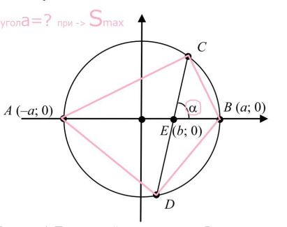

# Optimization_methods  
#1-ONE-DIMENSIONAL UNCONDITIONAL OPTIMIZATION
- dichotomy method for optimization task  
A circle of radius a is given (6). On the diameter AB there is a point E   (at a distance b (1) from the center) through which a chord CD is drawn.   Find the angle a at which the area of quadrilateral ACBD is maximal  
  
  
  
  
example:  

  #2-UNCONDITIONAL OPTIMIZATION  
- Newton's multiple method for optimization task 
  
  
  
example:  
  
  
  

  
